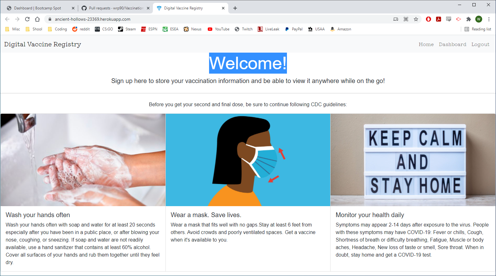

# Vaccination Tracker

## Table of Contents
- [Application Description](#Application&#32;Description)
- [Code Description](#Code&#32;Description)
- [Live Link](#Live&#32;Link)
- [Repository Link](#Repository&#32;Link)
- [Installation](#Installation)
- [Screenshots](#Screenshots)

## Application Description
The purpose of this application is to substitute the use of a physical card showing that an individual has received a COVID-19 vaccination. This is done by allowing the user to input the information on the card and store it digitally so that they may have quicker access to it in situations where needed.

## Code Description
The application is able to communicate with a database, store user sessions/cookies, generate dynamic HTML pages using templates, encrypt user passwords and display analytics. 

The database is created using mySQL and a schema is included to allow the generation of the database. The individual models used for each table are created by using Sequelize to allow easy development of the tables and setup the conditions of what kind of data can be stored in each property.

Sessions are used through express-session in order to allow persistent user data to be carried from page to page so that a user may only view their data and they will only have access to certain pages by having an account and logging in.

Handlbars.js was used to allow HTML pages to be dynamically created which assisted in redirecting users who are not logged in to the login page as well as showing a specific user their information when they are logged in.

bcrypt is the package that encrypts a users password to prevent it from being stored in the database in a plain text format. It is also used to check that the password the user is logging in with is correct.

The chart that is displayed on the user dashboard is done using Chart.js. It is able to display numerous types of charts and graphs based on the data provided to it. 

## Live Link
https://ancient-hollows-23369.herokuapp.com/

## Repository Link
https://github.com/wrp90/Vaccination_Tracker

## Installation
1. Git clone the repository onto the user machine.
2. Run npm install where the application was cloned. 
3. Use the schema.sql file in the db folder to create the databases.
4. Use the .env.EXAMPLE file as a template for creating an .env with the proper credentials.
5. Once the database has been created, use "npm run seed" in the terminal while in the root folder if example data is needed.

## Screenshots

